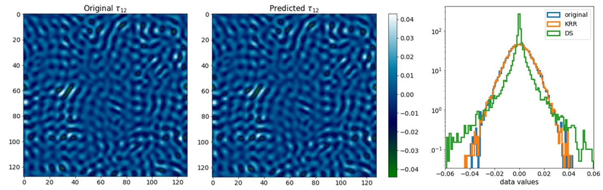
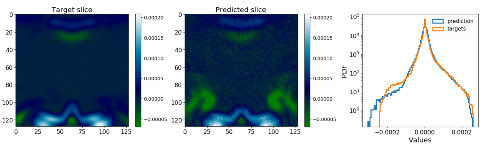

# Introduction

It has been challenging for domain sciences to adapt Machine Learning for their respective projects. 
From authors' background, it has been particularly difficult to employ ML for physical simulations. 
It is rather challenging to prove that a ML model has arbitrarily learned the laws of physics embedded into the problem, 
with the ability to extrapolate within the parameter-space of the simulation. Inability to directly infer the prediction 
capabilities of ML is one of the major causes the slow adaption rates, however the effectiveness of ML cannot be ignored by 
the community.

Turbulence is ubiquitous in astrophysical environments; however, it involves physics at a vast range of temporal and spatial 
scales, making accurate fully-resolved modeling difficult. Various analytical turbulence models have been developed to be used 
in simulations using time or spatial averaged governing equations, but accuracy is lacking. In search of better methods to model 
turbulence in core-collapse supernovae, it became apparent that ML has great potential 
to produce more accurate turbulence models on unaveraged subgrid scale than the current methods. Scientists from both industry and 
academia [@king2016, @zhang2018] have already began using ML for applied turbulent problems, but none reach out to 
a theoretical medium of physics and astronomy community on a practical level. For example, physics-based model 
evaluation and interpretability tools are not standardized nor they are widely available. As a result, it is a common 
struggle to verify published results, with the setup not fully disclosed, the code being poorly structured and/or commented or 
even worse - not publicly available; the problem ML community can relate to as well[cite a decade review]. Thus, it is to no surprise that skepticism 
against ML in physical sciences is very abundant, with astrophysics being no exception. [@carleo2019]

In pursuit of our supernovae (SNe) study, the issues outlined above became painfully apparent. Thus, we attempted to simplify 
the barrier to entry for new researchers in domain science fields to employ ML, with the main 
focus on astrophysical applications. As a result, a ML python-based pipeline called ``Sapsan`` has been developed. The goals have 
been to make it accessible and catered to the community through both command-line-interface (CLI) and graphical-user-interface (GUI) 
available for the end user. ``Sapsan`` includes built-in optimized ML models for turbulence treatment, both conventional and 
physics-based. More importantly, at its core the framework is meant to be flexible and modular, hence there is an intuitive 
interface for one to work on their own ML algorithms. In addition, ``Sapsan`` brings best practices from the industry when it 
comes to ML development frameworks. For example, those include docker containers for reproducible release, as well as 
MLflow\footnote{https://mlflow.org/} for experiment tracking.

This paper will go into details behind ``Sapsan`` following the outline:
    
* In Section \ref{sec:framework} the paper will go over ``Sapsan's``  technical details. We will introduce its structure, 
  capabilities, and provide description of the built-in CLI and GUI interfaces.
* In Section \ref{sec:applications} we will cover some of the applications in physical sciences. In particular we will delve 
  into uses in hydrodynamic (HD) and megnetohydrodynamic (MHD) simulations and supernovae modeling.
* In Section \ref{sec:discussion} a discussion will proceed on broader usability of ``Sapsan`` . In addition, the reader will 
  find information on near future and long terms plans of the framework's development.

# Framework

``Sapsan`` is built to be versatile, flexible, and reproducible, while being easy to use. In this section we will examine 
how each of these are achieved.

To begin, let's focus on a high-level overview of Sapsan. Logically project can be separated into three modules: core where 
all abstractions and necessary classes are located, lib where scientific context is coming to play implementing abstractions 
from core module and wrapping it up as reusable models in our case turbulence subgrid models and CLI - command line interface 
for project boilerplate initialization. Idea behind Sapsan approach is simple - organization of workflow within experiments 
which encapsulate data preparation and optimization \& training leading to a ready-to-go model (Fig.1). 
Now, let's consider a physical context in which we are working. In particular let's take the example of turbulence subgrid modeling, 
e.g. a model to predict turbulent behavior at the under-resolved simulation scales

* __Data Module__
  * __Data:__ 3D time-variable magnetohydrodynamic (MHD) turbulence data. ``Sapsan`` is ready to process common 3D HD and MHD turbulence data, 
    in simulation-code-specific data formats, such as HDF5 \& ATHDF (with more to come per community need).
  * __Features:__ usually, the necessary physical features needed for training have to be calculated at the data pre-processing 
    stage, such as energy, tensor components, and others. These operations are automated within ``Sapsan``.
  * __Filter:__ in order to build a subgrid model, one will have to filter the data, e.g. remove small-scale perturbations. 
    An example of such would be either a box or spectral filter.  The data can be filtered on the fly within the framework.
    
* __Machine Learning Module__

  * __Model Selection:__ different ML models would be appropriate for different physical regimes. Even though ``Sapsan`` cannot 
    account for every single physical setup, we have constrained our focus to those suitable for the study of core-collapse supernovae. More details 
    of ML models can be found in Section \ref{sec:discussion}.
  * __Optimize:__ every ML model has to be optimized. While basic hyperparameter optimization is currently included in ``Sapsan`` 
    (Section \ref{sec:framework}), physics-based optimizations are coming (Section \ref{sec:discussion}).
  * __Uncertainty:__ conventional and physics-based uncertainty estimation.

* __Model Module__
  *  __Closure Model:__ a turbulence subgrid model telling us how small-scale structure affects the large scale quantities, i.e. it completes 
    or ''closes'' the governing large-scale equations of motion with small-scale terms. The prediction from a trained ML model is 
    used to provide the needed quantities.

# Applications

While ``Sapsan`` is built to be highly customizable to be used in a wide variety of projects in physical sciences, one will find it particularly useful in the study of turbulence. 

## Hydro simulations

Here are a few examples of a turbulence closure model, trained on the high resolution Johns Hopkins Turbulence Database (JHTDB) [@jhtdb2008]. The dataset used in this comparison is a direct numerical simulation (DNS) of statistically-stationary isotropic 3D MHD
turbulence dataset, 10243 in resolution covering ~ one large eddy turnover time, e.i. dynamical time of the system
[@Eyink2013]. We are comparing with a commonly used Dynamic Smagorinsky (DS) turbulence closure model. On ``Sapsan``  side, a Kernel
Ridge Regression model [@murphy2004] is used to demonstrate the effectiveness of conventional ML approaches in tackling turbulence
problems. In this test we used the following setup:

* __Train features:__ velocity (*u*), vector potential (*A*), magnetic field (*B*), and their respective derivatives at timestep = 1. All quantities have been filtered to remove small-scale perturbations, mimicking the lower fidelity of a non-DNS simulation.
* __Model Input:__ low fidelity velocity (*u*), vector potential (*A*), magnetic field (*B*), and their respective derivatives at a set timestep in the future.
* __Model Output:__ velocity stress tensor ($\tau$) at the matching timestep in the future, which effectively represents the difference between large and small scale structures of the system.

In Figure \ref{fig:jhtdb}, it can be seen that ML-based approach significantly outperforms DS subgrid model in reproducing the probability density function, e.i. statistical distribution of the stress tensor. The results are consistent with [@king2016].

## Supernovae
If the conventional regression-based ML approach worked well in the previous section, why would one want more? Supernovae host a
different physical regime that is far from the idealistic MHD turbulence case from before. Here we are dealing with dynamically
changing statistics and evolution of the turbulence that is not necessarily isotropic. Depending on the evolutionary stage, turbulence
can behave drastically different, hence a more sophisticated model is required. With ``Sapsan``, we have tested a 3D CNN model 
in attempts to predict a turbulent velocity stress tensor in a realistic CCSN case. Figure 3 presents results of the following:

* __Train features:__ velocity (*u*), magnetic field (*B*), and their respective derivatives at timestep = 1. All quantities have been filtered to remove small-scale perturbations, mimicking the lower fidelity of a non-DNS simulation.
* __Model Input:__ low fidelity velocity (*u*), magnetic field (*B*), and their respective derivatives at a set timestep in the future.
* __Model Output:__ velocity stress tensor ($\tau$) at the matching timestep in the future, which effectively represents the difference between large and small scale structures of the system.

In this case, the matching level of the distributions is the most important factor. It can be seen that the probability density functions match quite closely, with the outlier beeing the exception, even though prediction is done far into the future (timestep=500). For further discussion on comparison of the models and the results, please refer to [the ApJ paper].

# Acknowledgements
Development of ``Sapsan`` was supported by the Laboratory Directed Research and Development program and the Center for Space and Earth Science at Los Alamos National Laboratory through the student fellow grant. In addition, We would like to thank DOE SciDAC for additional funding support.

# References
