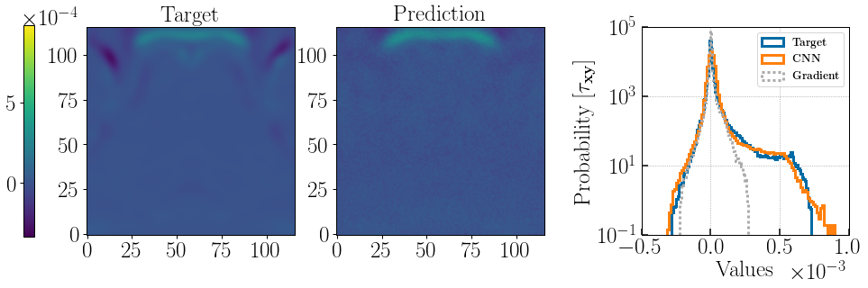

# Summary
[``Sapsan``](https://github.com/pikarpov-LANL/Sapsan) is a framework designed to make Machine Learning (ML) more accessible in the study of turbulence, with a focus on astrophysical applications. ``Sapsan`` includes modules to load, filter, subsample, batch, and split the data from hydrodynamic (HD) simulations for training and validation. Next, the framework includes built-in conventional and physically-motivated estimators that have been used for turbulence modeling. This ties into ``Sapsan``'s custom estimator module, aimed at designing a custom ML model layer-by-layer, which is the core benefit of using the framework. To share your custom model, every new project created via ``Sapsan`` comes with pre-filled, ready-for-release Docker files. Furthermore, training and evaluation modules come with ``Sapsan`` as well. The latter, among other features, includes the construction of power spectra and comparison to established analytical turbulence closure models, such as a gradient model. Thus, ``Sapsan`` attempts to minimize the hard work required for data preparation and analysis, leaving one to focus on the ML model design itself.

# Statement of Need

Domain sciences have been slow to adopt Machine Learning (ML) for a range of projects, but particularly for physical simulations modeling turbulence. It is challenging to prove that an ML model has learned the laws of physics in a particular problem, and that it has the ability to extrapolate within the parameter-space of the simulation. The inability to directly infer the predictive capabilities of ML is one of the major causes behind the slow adoption rates; however, the community cannot ignore the effectiveness of ML.

Turbulence is ubiquitous in astrophysical environments, however, it involves physics at a vast range of temporal and spatial scales, making accurate fully-resolved modeling difficult. Various analytical turbulence models have been developed to be used in simulations using temporal or spatial averaged governing equations, such as RANS (Reynolds-averaged Navier-Stokes) and LES (Large Eddy Simulation), but the accuracy of these methods is sometimes inadequate. In search of better methods to model turbulence in core-collapse supernovae, it became apparent that ML has the potential to produce more accurate turbulence models on an un-averaged subgrid-scale than the current methods. Scientists from both industry and academia [@king2016; @zhang2018] have already begun using ML for applied turbulent problems. Still, none of these efforts have yet reached the scales relevant for the physics and astronomy community on a practical level. For example, physics-based model evaluation and interpretability tools are not standardized, nor are they widely available. As a result, it is a common struggle to verify published results, with the setup not fully documented, the opaquely structured code lacking clear commenting, or even worse, not publicly available. This is a problem that the broader ML community can relate to as well [@Hutson725]. Thus, it is not surprising that there is considerable skepticism against ML in physical sciences, with astrophysics being no exception [@carleo2019].

In pursuit of our supernova (SNe) study, the issues outlined above became painfully apparent. Thus, we have attempted to lower the barrier to entry for new researchers in domain science fields studying turbulence to employ ML, with the main focus on astrophysical applications. As a result, we developed an ML Python-based pipeline called ``Sapsan``. The goals have been to make this library accessible and shared with the community through Jupyter Notebooks, a command-line-interface (CLI) and a graphical-user-interface (GUI)[^demo] available for end-users. ``Sapsan`` includes built-in optimized ML models for turbulence treatment, both conventional and physics-based. More importantly, at its core, the framework is meant to be flexible and modular; hence there is an intuitive interface for users to work on their own ML algorithms. Most of the mundane turbulence ML researcher needs, such as data preprocessing and prediction analysis, can be automated through ``Sapsan``, with a streamlined process of custom estimator development. In addition, ``Sapsan`` brings best practices from the industry regarding ML development frameworks. For example, ``Sapsan`` includes docker containers for reproducible release, as well as [MLflow](https://mlflow.org/) for experiment tracking. Thus, ``Sapsan`` is a single, complete interface for ML-based turbulence research.

[^demo]: A demo is available at [sapsan.app](https://sapsan.app/).

`Sapsan` is distributed through [GitHub](https://github.com/pikarpov-LANL/Sapsan) and [pip](https://pypi.org/project/sapsan/). For further reference, [wiki](https://github.com/pikarpov-LANL/Sapsan/wiki) is maintained on GitHub as well.

# Framework
``Sapsan`` organizes workflow via three respective stages: data preparation, machine learning, and analysis, as shown in Figure 1. The whole process can be further distributed using Docker for reproducibility. Let's break down each stage in the context of turbulence subgrid modeling, e.g., a model to predict turbulent behavior at the under-resolved simulation scales.

* __Data Preparation__
  * __Loading Data:__ ``Sapsan`` is ready to process common 2D & 3D hydrodynamic (HD) and magnetohydrodynamic (MHD) turbulence data in simulation-code-specific data formats, such as HDF5 (with more to come per community need).
  * __Transformations:__ A variety of tools are available for the user to prepare data for training:
     * __Filtering:__ To build a subgrid model, one will have to filter the data to, for example, remove small-scale perturbations. Some possible choices include a box, spectral, or Gaussian filter. The data can be filtered on the fly within the framework.
     * __Sampling:__ to run quick tests of your model, you might want to test on a sampled version of the data while retaining the full spatial domain. For this application, equidistant sampling is available in ``Sapsan``.
     * __Batching & Splitting:__ The data are spatially batched and divided into testing and validation subsets.
    
* __Machine Learning__

  * __Model Setup:__ Different ML models may be appropriate for different physical regimes, and ``Sapsan`` provides templates for a selection of both conventional and physics-based models with more to come. Only the most important options are left up to the user to edit, with most overhead kept in the backend. This stage also includes tools for defining ML layers, tracking parameters, and choosing and tuning optimization algorithms.

* __Analysis__
  *  __Trained Model:__ A turbulence subgrid model defines how small-scale structure affects the large scale quantities. In other words, it completes or ''closes'' the governing large-scale equations of motion with small-scale terms. The prediction from a trained ML model is used to provide the needed quantities.
  *  __Analytical Tools:__ There are also methods included for comparing the trained model with conventional analytic turbulence models [such as the Dynamic Smagorisnky, @lilly1966; or Gradient, @liu_meneveau_katz_1994; models], or to conduct other tests of, for example, the power spectrum of the model prediction.

For further information on each stage, please refer to [``Sapsan``'s Wiki on Gihub](https://github.com/pikarpov-LANL/Sapsan/wiki).

### Dependencies
The following is a list of the core functional dependencies[^deps] and a short description of how they are used within ``Sapsan``:

[^deps]: Please refer to [GitHub](https://github.com/pikarpov-LANL/Sapsan) for the complete list of dependencies.

* __PyTorch:__ `Sapsan`, at large, relies on PyTorch to configure and train ML models. Thus, the parameters in the aforementioned __Model Setup__ stage should be configured with PyTorch functions. [Convolutional Neural Network (CNN)](https://github.com/pikarpov-LANL/Sapsan/blob/master/sapsan/examples/cnn_example.ipynb) and [Physics-Informed Convolutional Auto Encoder (PICAE)](https://github.com/pikarpov-LANL/Sapsan/blob/master/sapsan/examples/picae_example.ipynb) examples included with `Sapsan` are based on PyTorch. [@pytorch]

* __Scikit-learn:__ A alternative to `PyTorch`, as demonstrated in the [Kernel Ridge Regression (KRR)](https://github.com/pikarpov-LANL/Sapsan/blob/master/sapsan/examples/krr_example.ipynb) example in `Sapsan`. Since `scikit-learn` is less flexible and scalable than `PyTorch`, `PyTorch` is the recommended interface. [@scikit-learn]

* __Catalyst:__ used as part of the backend to configure early-stopping of the model and logging. [@catalyst]

* __MLflow:__ provides an intuitive web interface for tracking the results of large experiments and parameter studies. Beyond a few default parameters, a user can include custom parameters to be tracked. [@mlflow_github]

* __Jupyter Notebook:__ the most direct and versatile way to use `Sapsan`.

* __Streamlit (GUI):__ a graphical user interface (GUI) for `Sapsan`. While not as flexible as the other interfaces, this can be useful for developing public-facing demonstrations. An example of this interface can be found online at [sapsan.app](https://sapsan.app). [@streamlit2019]

* __Click (CLI):__ a command-line interface (CLI) for `Sapsan`. It is used to get the user up and running with templates for a custom project. [@click]

# Applications

While ``Sapsan`` is designed to be highly customizable for a wide variety of projects in the physical sciences, it is optimized for the study of turbulence. In the next section we will demostrate various capabilities of Sapsan working with 2D and 3D data, various machine learning libraries, and built-in analytical tools.

## Hydro simulations

Here is an examples of a turbulence closure model trained on the high-resolution Johns Hopkins Turbulence Database [JHTDB, @jhtdb2008]. The dataset used in this comparison is a 2D slice of a direct numerical simulation (DNS) of a statistically-stationary isotropic 3D MHD turbulence dataset, $1024^3$ in spatial resolution and covering roughly one large eddy turnover time over 1024 checkpoints, i.e. the dynamical time of the system [@Eyink2013]. We compare it with a commonly used Dynamic Smagorinsky (DS) turbulence closure model [@lilly1966]. On the ``Sapsan`` side, a Kernel Ridge Regression model [@murphy2004] by the means of `scikit-learn` is used to demonstrate the effectiveness of conventional ML approaches in tackling turbulence problems. In this test, we used the following setup:

* __Train features:__ velocity (*u*), vector potential (*A*), magnetic field (*B*), and their respective derivatives at time step = 1. All quantities have been filtered down to 15 Fourier modes to remove small-scale perturbations, mimicking the lower fidelity of a non-DNS simulation. Next they were sampled down to $128^3$, with the last step leaving a single slice of $128^2$ ready for training.
* __Model Input:__ low fidelity velocity (*u*), vector potential (*A*), magnetic field (*B*), and their respective derivatives at a set time step in the future.
* __Model Output:__ velocity stress tensor component ($\tau_{xy}$) at the matching time step in the future, which effectively represents the difference between large and small scale structures of the system.

In Figure 2, it can be seen that the ML-based approach significantly outperforms the DS subgrid model in reproducing the probability density function, i.e., a statistical distribution of the stress tensor. The results are consistent with [@king2016].

## Supernovae
Even though the conventional regression-based ML approach worked well in the 2D setup from the previous section, the complexity of our physical problem forced us to seek a more rigorous ML method. Supernovae host a
different physical regime that is far from the idealistic MHD turbulence case from before. Here we are dealing with dynamically
evolving turbulence that is not necessarily isotropic. Turbulence can behave drastically differently depending on the evolutionary stage; hence, a more sophisticated model is required. With ``Sapsan``, we have tested a 3D CNN (Convolutional Neural Network) model built with `PyTorch` to predict a turbulent velocity stress tensor in a realistic Core-Collapse Supernova (CCSN) case. Figure 3 presents results of the following:

* __Train features:__ velocity (*u*), magnetic field (*B*), and their respective derivatives at time steps before 5 ms (halfway of the total simulation). All quantities have been filtered down with a $\sigma=9$ Gaussian filter to remove small-scale perturbations, mimicking the lower fidelity of a non-DNS simulation. Lastly they were sampled from the original $348^3$ down to $116^3$ in resolution.
* __Model Input:__ low fidelity velocity (*u*), magnetic field (*B*), and their respective derivatives at a set time step in the future.
* __Model Output:__ velocity stress tensor components ($\tau_{ij}$) at the matching time step in the future, which effectively represents the difference between large and small scale structures of the system.

In this case, the probability density functions are overall consistent, with minor disagreement at the positive outliers, even though the prediction is performed far into the future (time = 9.48 ms, end of the simulation time). Predictive advantage is highlighted when compared with the analytical Gradient model that misses a large portion of positive data.

# Acknowledgements
The development of ``Sapsan`` was supported by the Laboratory Directed Research and Development program and the Center for Space and Earth Science at Los Alamos National Laboratory through the student fellow grant. We would like to thank DOE SciDAC for additional funding support.

# References
