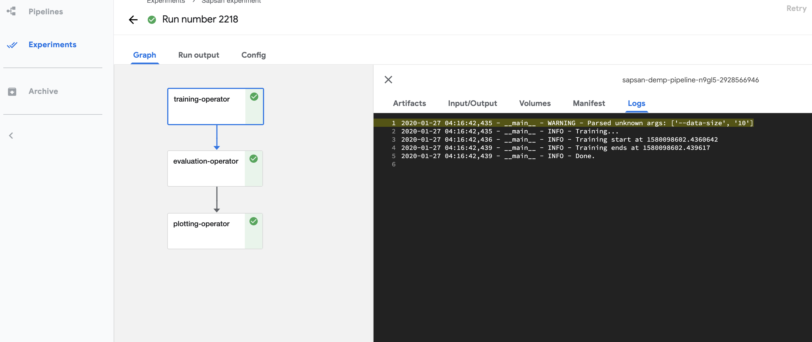
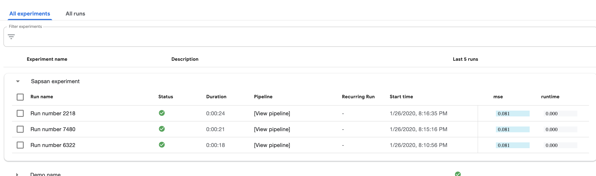

Deployment to kubeflow
====

### Reproducible experiment

To enable reproducability of experiments we followed specific guidlines and implement experiment flow within Kubeflow framework.

**Requirements**

- [Vagrant](https://www.vagrantup.com/downloads.html)
- [VirtualBox](https://www.virtualbox.org/wiki/Downloads)

**Installation**

[Installation procedure](./docs/kubeflow/installation.md)

### Once kubeflow installed

To run mock experiment and get a sense of how it works:

- Open kubeflow UI
- Create notebook instance
- Import [this notebook](../kubeflow/pipelines/mock_pipeline/kubeflow.ipynb)
- Run all paragraphs

### Images

